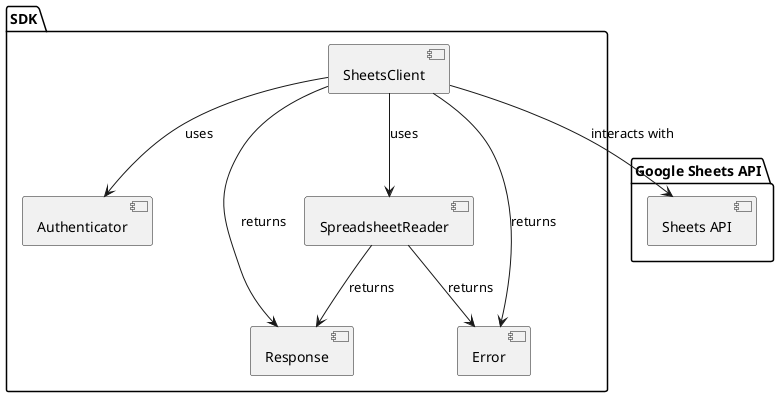

# Google spreadsheets
## 基本設計

### 概要

このSDKは、Google Sheets APIをラップし、アプリケーションがGoogleスプレッドシートの内容を読み取るための機能を提供します。認証、データ取得、エラーハンドリングなどの基本的な操作を簡素化することを目的とします。

### コンポーネント

1. **`SheetsClient`**: Google Sheets APIとの通信を管理するメインクライアント。認証情報の管理、APIリクエストの送信、レスポンスの処理を行います。
2. **`Authenticator`**: Google Sheets APIへの認証を処理するコンポーネント。APIキーまたはOAuth 2.0フローをサポートします。
3. **`SpreadsheetReader`**: 特定のスプレッドシートからデータを読み取る機能を提供します。シートの指定、範囲の指定、データの取得を行います。
4. **`Response`**: APIからのレスポンスを表現する構造体。成功または失敗の状態、データ、エラー情報などを持ちます。
5. **`Error`**: SDK内で発生する可能性のあるエラーを定義するenum。

### アーキテクチャ図

### 各コンポーネントの詳細

#### `SheetsClient`

- **責務**: Google Sheets APIとの通信を一元的に管理します。
- **機能**:
    - `Authenticator`を使用してAPIへの認証を行います。
    - APIエンドポイントの管理。
    - HTTPリクエストの送信とレスポンスの受信。
    - エラーハンドリングとリトライロジック。

#### `Authenticator`

- **責務**: Google Sheets APIへの認証を処理します。
- **機能**:
    - APIキー認証またはOAuth 2.0認証フローをサポートします。
    - アクセストークンの取得と管理。
    - トークンのリフレッシュ。

#### `SpreadsheetReader`

- **責務**: 特定のスプレッドシートからデータを読み取ります。
- **機能**:
    - スプレッドシートIDとシート名を指定してデータを取得します。
    - 読み取るセルの範囲を指定できます。
    - 取得したデータを構造化された形式で返します。

#### `Response`

- **責務**: API呼び出しの結果を表現します。
- **属性**:
    - `is_success`: 処理が成功したかどうかを示す真偽値。
    - `data`: 成功した場合のデータ。
    - `error`: 失敗した場合のエラー情報。

#### `Error`

- **責務**: SDK内で発生する可能性のあるエラーを定義します。
- **種類**:
    - `AuthenticationError`: 認証に関連するエラー。
    - `ApiError`: Google Sheets APIからのエラーレスポンス。
    - `NetworkError`: ネットワーク接続に関するエラー。
    - `ParseError`: レスポンスデータのパースエラー。
    - `OtherError`: その他のエラー。

### 利用の流れ

1. `Authenticator`を使用して認証を行います。
2. `SheetsClient`を初期化し、`Authenticator`を渡します。
3. `SpreadsheetReader`を使用して、`SheetsClient`経由でスプレッドシートのデータを読み取ります。
4. `Response`オブジェクトを通じて結果を受け取ります。

### 今後の展開

- 書き込み機能の追加
- より複雑なクエリのサポート
- バッチ処理のサポート

## 実装タスク

### 基本設定と認証
- 📝 Google Cloud Projectの設定
  - Google Cloud Projectの作成
  - Google Sheets APIの有効化
  - 認証情報（APIキー、OAuth 2.0クライアント）の作成

### コアコンポーネントの実装
- 📝 `SheetsClient` の実装
  - HTTP クライアントの実装
  - API エンドポイントの定義
  - リトライロジックの実装
  - エラーハンドリングの実装

- 📝 `Authenticator` の実装
  - APIキー認証の実装
  - OAuth 2.0認証フローの実装
  - トークン管理機能の実装
  - トークンリフレッシュロジックの実装

- 📝 `SpreadsheetReader` の実装
  - スプレッドシートデータ取得機能の実装
  - セル範囲指定機能の実装
  - データ構造化機能の実装

- 📝 `Response` 構造体の実装
  - 成功/失敗状態の管理
  - データ構造の定義
  - エラー情報の管理

- 📝 `Error` 列挙型の実装
  - 各種エラー型の定義
  - エラーメッセージの実装
  - エラーハンドリングロジックの実装

### テストとドキュメント
- 📝 単体テストの実装
  - 各コンポーネントのテストケース作成
  - モックの実装
  - エラーケースのテスト

- 📝 統合テストの実装
  - 実際のGoogle Sheets APIを使用したテスト
  - エンドツーエンドのテストシナリオ作成

- 📝 APIドキュメントの作成
  - 各コンポーネントの使用方法
  - エラーハンドリングのガイドライン
  - サンプルコードの作成

### パフォーマンス最適化
- 📝 パフォーマンス最適化
  - キャッシュ機能の実装
  - バッチ処理の最適化
  - メモリ使用量の最適化

### メモリプロファイリング
- 📝 メモリ使用量の測定と分析
  - メモリプロファイラの実装
    - アロケーション追跡
    - ヒープ使用量の測定
    - メモリリークの検出
  - 測定結果の出力機能
    - JSON形式でのメモリ使用状況の出力
    - 時系列データの記録
    - ピーク時のメモリ使用量の記録
  - 分析レポートの生成
    - コンポーネントごとのメモリ使用量サマリー
    - 大規模データセット処理時のメモリ使用傾向
    - 最適化推奨事項の自動生成

### CPUプロファイリング
- 📝 CPU使用状況の測定と分析
  - CPUプロファイラの実装
    - 関数呼び出しの追跡
    - 実行時間の測定
    - ホットスポットの検出
    - スレッド使用状況の監視
  - 測定結果の出力機能
    - JSON形式でのCPU使用状況の出力
    - フレームグラフ生成用データの記録
    - 時系列パフォーマンスデータの記録
  - 分析レポートの生成
    - 処理時間の内訳
    - ボトルネックとなっている関数の特定
    - 並列処理の効率分析
    - パフォーマンス改善提案の自動生成

### Example実装
- 📝 基本的な読み込みExample
  - シート全体の読み込み
  - 特定の範囲の読み込み
  - 条件付き読み込み（フィルタリング）
  - 複数シートの同時読み込み
  - データ型を指定した読み込み
    - 数値データの読み込み
    - 日付データの読み込み
    - 数式の結果の読み込み

- 📝 基本的な書き込みExample
  - 単一セルの書き込み
  - 範囲指定での書き込み
  - バッチ書き込み
  - データ型を指定した書き込み
    - 数値データの書き込み
    - 日付データの書き込み
    - 数式の書き込み

- 📝 高度な操作Example
  - シートの作成・削除
  - シート名の変更
  - セルの書式設定
  - 条件付き書式の設定
  - フィルタの設定
  - ピボットテーブルの作成

- 📝 エラーハンドリングExample
  - 認証エラーの処理
  - APIレート制限の処理
  - ネットワークエラーの処理
  - データ型変換エラーの処理
  - 権限エラーの処理

- 📝 パフォーマンス最適化Example
  - バッチ処理による最適化
  - キャッシュを使用した最適化
  - 並列処理による最適化
  - メモリ使用量の最適化
  - リクエスト数の最適化

## 開発環境のセットアップ

### テスト用スプレッドシート

開発とテストのために、以下のテスト用スプレッドシートが用意されています：

- スプレッドシートURL: https://docs.google.com/spreadsheets/d/1OU4eEeDargcZTPaW7O5FNYE_vyrUQRysGCVYzAiOChQ/edit?usp=sharing
- 用途: SDKの開発時の動作確認およびテストケース実行
- アクセス権限: 開発者に対して閲覧・編集権限が付与されています
- 注意事項: このスプレッドシートはテスト用です。実際のプロダクションデータを含まないようにしてください

### 認証情報の設定

1. `GOOGLE_CRED`環境変数にサービスアカウントの認証情報（JSON形式）を設定します
2. テスト実行時は、この環境変数が正しく設定されていることを確認してください

## PRごとの実装計画

### PR#1: 基本設定とコア認証機能 (済)
- ✅ Google Cloud Projectの設定
  - Google Cloud Projectの作成
  - Google Sheets APIの有効化
  - 認証情報の作成
- ✅ `Authenticator`の基本実装
  - APIキー認証の実装
  - OAuth 2.0認証フローの実装
- ✅ 基本的なエラー型の定義
- ✅ 認証に関する単体テスト

### PR#2: 基本的なシートクライアント実装 (実装中)
- 🔄 `SheetsClient`の基本実装
  - HTTP クライアントの実装
  - 基本的なAPI エンドポイントの定義
- 🔄 `Response`構造体の実装
- 🔄 基本的なエラーハンドリング
- 🔄 クライアントの単体テスト

### PR#3: 読み込み機能の実装
- 📝 `SpreadsheetReader`の基本実装
  - シート全体の読み込み
  - 特定範囲の読み込み
  - データ型変換の実装
- 📝 読み込み機能の単体テスト
- 📝 基本的な読み込みExample

### PR#4: 書き込み機能の実装
- 📝 `SpreadsheetWriter`の実装
  - 単一セルの書き込み
  - 範囲指定での書き込み
  - データ型変換の実装
- 📝 書き込み機能の単体テスト
- 📝 基本的な書き込みExample

### PR#5: 高度な操作機能
- 📝 シート管理機能の実装
  - シートの作成・削除
  - シート名の変更
- 📝 書式設定機能の実装
- 📝 高度な操作のExample実装
- 📝 統合テストの追加

### PR#6: バッチ処理とパフォーマンス最適化
- 📝 バッチ処理機能の実装
  - 複数シートの同時操作
  - バッチ書き込み
- 📝 キャッシュ機能の実装
- 📝 パフォーマンス最適化Example
- 📝 パフォーマンステストの追加

### PR#7: プロファイリング機能
- 📝 メモリプロファイラの実装
  - 測定機能の実装
  - JSON出力機能の実装
- 📝 CPUプロファイラの実装
  - 測定機能の実装
  - JSON出力機能の実装
- 📝 プロファイリングExample

### PR#8: エラーハンドリングの強化
- 📝 詳細なエラー型の追加
- 📝 リトライロジックの実装
- 📝 エラーハンドリングExample
- 📝 エラーケースのテスト強化

### PR#9: ドキュメントとExample完成
- 📝 APIドキュメントの完成
- 📝 残りのExampleの実装
- 📝 READMEの更新
- 📝 チュートリアルの作成

